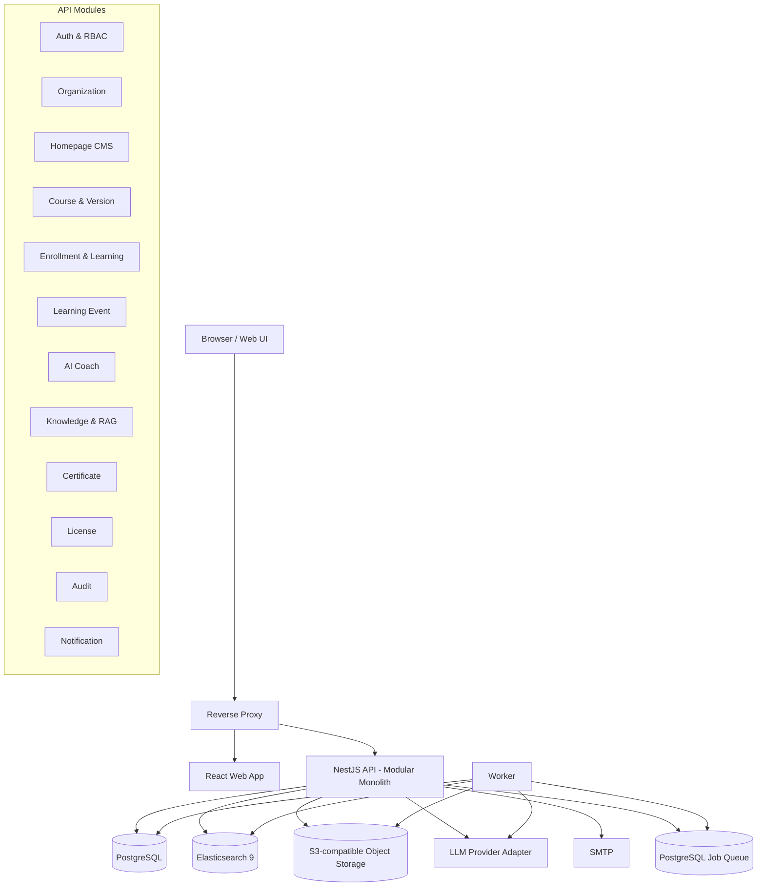
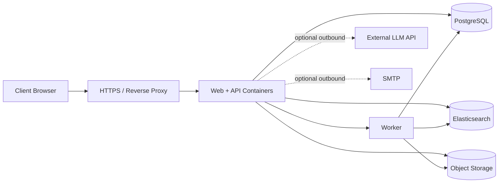
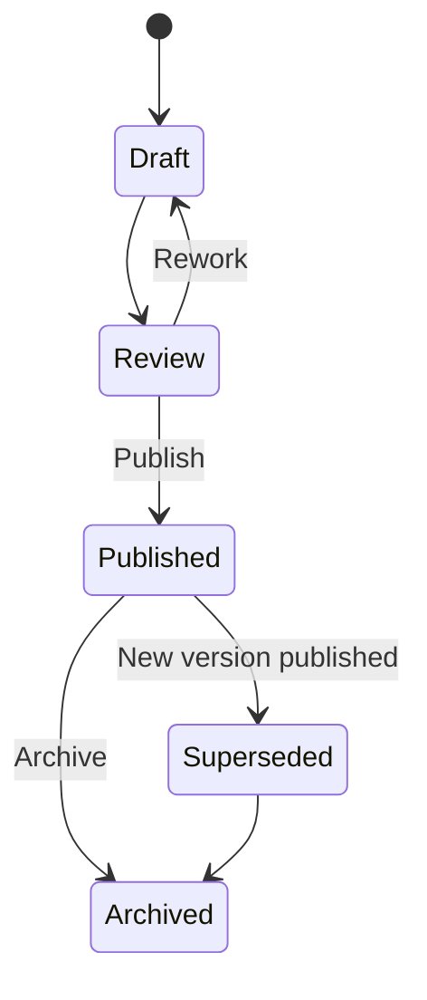
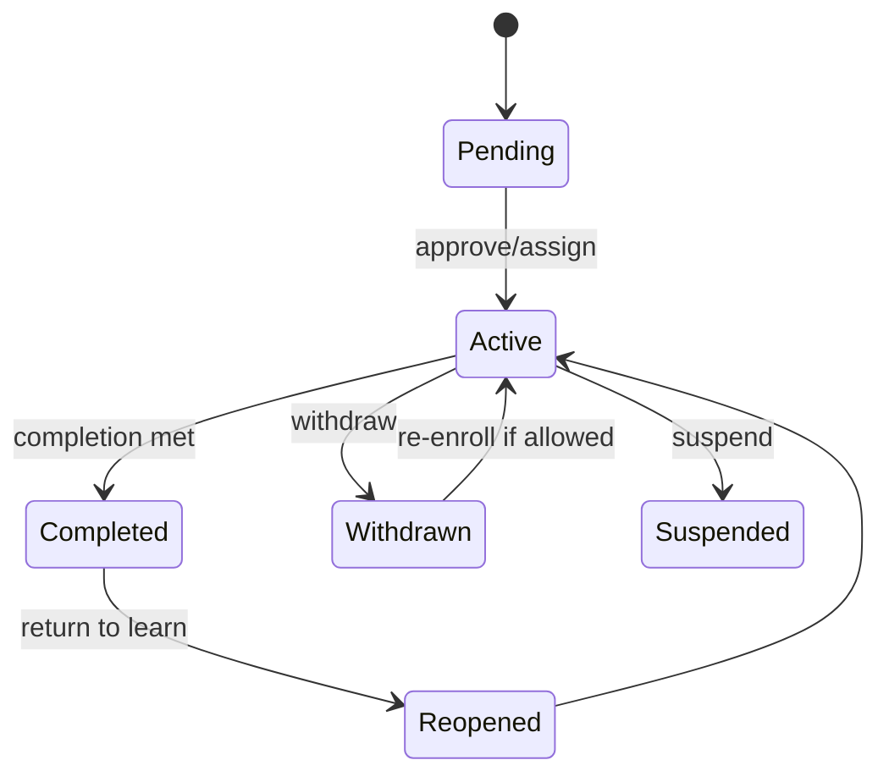
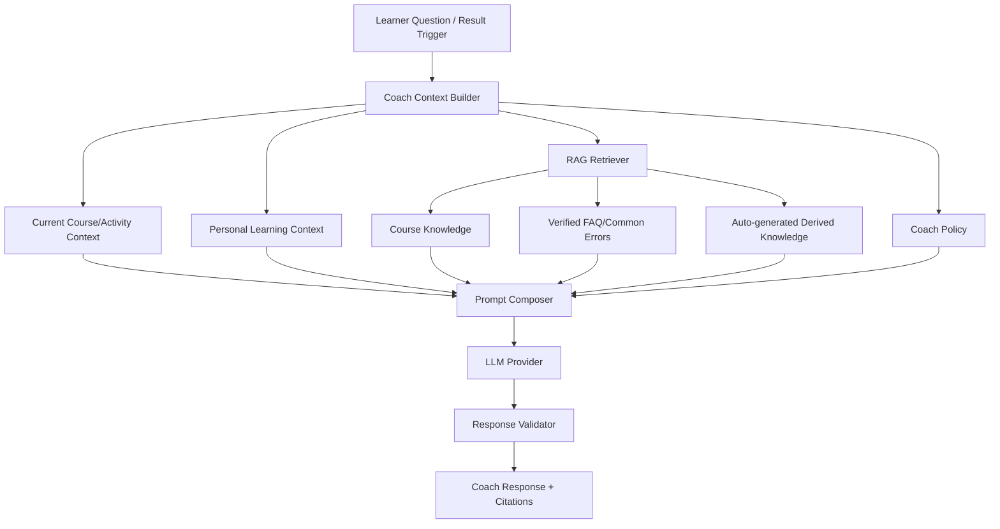
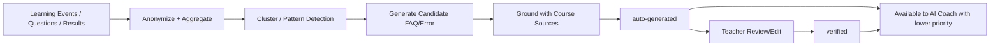
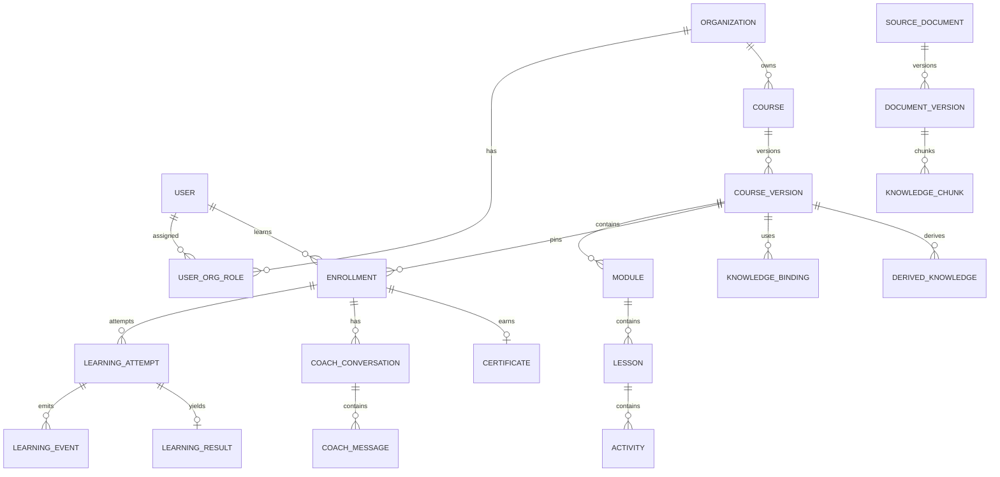

# 通用互動式教學系統 + AI Coach 系統架構基準文件

**文件名稱**：Interactive AI Coach System Architecture  
**文件版本**：v1.0  
**日期**：2026-09-09  
**文件定位**：可直接交付 Coding AI / System Analyst / Software Designer，作為後續 SA、SD、DB Schema、OpenAPI、Sprint Backlog 與實作的架構基準。  
**主文件格式**：Markdown；Word 為同步審閱版本。  

---

## 0. 文件使用規則

本文件是「架構基準（Architecture Baseline）」而不是概念提案。後續產出 SA/SD 時，除非建立 ADR（Architecture Decision Record）並說明理由，不應任意改變本文件中的核心邊界、權限模型、資料隔離原則、課程版本策略、AI Coach 證據鏈與授權行為。

### 0.1 對 Coding AI 的執行指令

後續 Coding AI 應依下列順序產出：

1. 先讀完整份文件，不得只依單一章節直接實作。
2. 先產出 SA：模組、Use Case、Sequence、ERD、RBAC、API Boundary、NFR Traceability。
3. 再產出 SD：資料表、欄位、索引、API Schema、狀態機、錯誤碼、Queue Job、Security Controls。
4. 再建立 Repo Skeleton、Migration、OpenAPI、測試骨架。
5. MVP 必須維持「模組化單體 + Worker」；除非有量測證據，不得自行拆成微服務。
6. AI 不得成為成績/通過與否的裁判。評量結果由既有規則、題目答案、Rubric 或教學活動本身產生；AI Coach 僅負責解釋、提示、引導、修正建議與延伸學習。
7. 每一個 AI Coach 回答都必須能回溯至「來源資料」或「學員自己的學習上下文」。不可將其他學員的個人資料作為回答來源。
8. 已發布的課程版本視為不可變（immutable）；不得直接 UPDATE 影響既有學員的學習內容。
9. 所有多組織資料查詢必須帶 organization scope；搜尋索引亦同。
10. 所有管理/內容/授權的重要變更必須有 Audit Log。

---

# 1. 系統目標與範圍

## 1.1 產品定位

本系統是一套**通用型互動式教學平台**，核心由下列三部分組成：

- 互動式課程與學習活動（Interactive Learning）
- 可追蹤的學習歷程與課程修業管理（Learning Lifecycle）
- 具來源依據、理解目前學習情境的 AI Learning Coach

不限定餐飲、烘焙、資訊、企業訓練或特定教學領域。課程內容與互動元件可由教師配置或擴充。

## 1.2 核心產品原則

1. **AI 是教練，不是裁判**：AI 不重新判分，不覆寫系統結果。
2. **回答需有依據**：RAG 回答需引用可點擊來源；若引用學習歷程，僅可引用該學員自己的紀錄或匿名彙整結果。
3. **課程發布後可追溯**：學員綁定明確的課程版本。
4. **多組織隔離**：資料、知識庫、搜尋、課程與 AI Context 必須受組織/課程 ACL 約束。
5. **中輕型架構優先**：第一版不採微服務，不引入 Kafka、Service Mesh 等非必要元件。
6. **On-premise / Private Cloud 同一套容器架構**：SaaS 只保留 tenancy 與擴充邊界，不在第一版實作。
7. **可維運、可備份、可升級**：所有重要資料有明確備份與還原策略。
8. **授權行為由 License Policy 控制**：避免散落在 UI 內硬編碼。

## 1.3 第一版 In Scope

- 多組織與多角色 RBAC
- 首頁 CMS
- 課程建立、版本化、發布、封存
- 互動式影片與一般互動元件
- 課程加入/指派/退課/重修/完成
- 可設定完成條件
- 學習事件、結果、學習歷程
- 教師檢視全班成果與個別歷程
- 學員檢視自己的成果、歷程與證書
- AI Coach：提問、結果後引導、修正建議
- RAG：教材、FAQ、常見錯誤、課程知識
- 自動形成 FAQ / Common Error + 教師編修/驗證
- 可點擊來源 Viewer
- 電子結業證明、QR/驗證碼與撤銷
- License：Subscription / Perpetual / Trial / Grace / Maintenance
- Audit、通知、備份/還原、基本監控
- Local Account；SSO 擴充介面預留

## 1.4 第一版 Out of Scope

- 完整 SaaS 商業計費與自助開通
- Kubernetes 為必要部署前提
- 多區域 Active-Active
- AI 自主 Agent 代替管理者操作平台
- AI 自動修改成績或 Rubric
- 即時視訊教室 / WebRTC
- 完整 LMS 替代功能（選課排課、校務、財務等）
- LTI/xAPI 對外整合的正式實作（保留 API/資料模型）
- 自建大型模型訓練平台

---

# 2. 角色與權限模型

## 2.1 角色

| 角色 | 範圍 | 主要責任 |
|---|---|---|
| Platform Administrator | 平台層 | 平台設定、授權、全域 AI Provider、組織、備份、平台 Audit。Private Cloud 可保留在維運 Team。 |
| Organization Administrator | 組織層 | 組織使用者、角色、品牌設定、課程管理、組織級報表。不得修改平台授權與全域安全設定。 |
| Course Administrator | 課程管理層 | 建課、開課/關課、指派教師、招生/加入機制、重修、證書管理。 |
| Instructor | 課程內容層 | 編輯課程草稿、上傳教材、互動活動、AI Coach Policy、查看該課所有學員成果。 |
| Learner | 個人 | 學習、提問、互動、查看自己的歷程、結果、進度、證書。 |
| Auditor / Viewer | 唯讀 | 依授權範圍查看課程、學習統計、稽核紀錄，不可修改。 |

> 實作上採 RBAC + Scope，而不是將所有權限寫死在角色名稱。角色只是 Permission Set 的預設集合。

## 2.2 權限矩陣（MVP）

| 能力 | Platform Admin | Org Admin | Course Admin | Instructor | Learner | Auditor |
|---|:---:|:---:|:---:|:---:|:---:|:---:|
| 平台授權 | RW | - | - | - | - | R* |
| 組織建立/停用 | RW | - | - | - | - | R* |
| 組織使用者管理 | R | RW | R | - | Self | R* |
| 首頁 CMS | RW | 可委派 | - | - | R | R |
| 課程建立/封存 | R | RW | RW | 可委派 | R | R |
| 課程內容草稿 | R | R | RW | RW | - | R |
| 課程發布 | R | 可設定 | RW | 可授權 | - | R |
| 查看全課學員成果 | R | R | R | R | - | R* |
| 查看自己學習紀錄 | - | - | - | - | R | - |
| 退回重修 | - | 可設定 | RW | 可授權 | - | R |
| AI Coach Policy | R | R | R | RW | - | R |
| AI Coach 使用 | 可測試 | 可測試 | 可測試 | 可測試 | R/W互動 | R* |
| FAQ/Common Error 編修 | R | R | R | RW | - | R |
| 證書撤銷 | R | 可設定 | RW | - | R自己 | R |
| Audit Log | RW查詢 | R組織 | R課程 | R課程相關 | R自己的敏感操作摘要 | R |

`R*` 代表需另授權 scope。

## 2.3 多組織邊界

所有具組織屬性的業務資料至少包含 `organization_id`；所有 API 經 Authentication 後，Authorization Middleware 解析：

- platform scope
- organization scope
- course scope
- self scope

禁止由前端傳入的 `organization_id` 直接成為可信授權依據；必須由 Token/Session 的可用 scope 與資源 ownership 交叉驗證。

---

# 3. 建議技術基線

## 3.1 Reference Stack

| 區域 | 建議 | 說明 |
|---|---|---|
| Web Frontend | React + TypeScript | 管理端、教師端、學員端可共用 design system 與 routing。 |
| UI State | XState v5（需要時） | 適合互動活動、課程 Runtime、狀態明確的流程。 |
| Interactive Video | H5P Interactive Video Adapter | 商品化常見互動；不要把整個平台綁死 H5P。 |
| Custom Interaction | React Components | 特殊模擬器、參數操作、拖拉、情境互動。 |
| Node/Flow Interaction | React Flow（選用） | 流程排序、節點、關係圖型活動。 |
| Backend | NestJS + TypeScript（模組化單體） | 清楚 module boundary、Guard、OpenAPI、DI；可用 Fastify adapter。 |
| Relational DB | PostgreSQL 17/18 | 系統主資料、權限、課程、事件、結果、授權 metadata。 |
| Search/RAG | Elasticsearch 9 | Lexical + semantic/hybrid search、metadata filter、RAG。 |
| Object Storage | S3-compatible adapter | 原始教材、影片、圖片、證書；On-prem 可選相容實作，Private Cloud 可接雲端 S3。 |
| Async Jobs | PostgreSQL-backed job queue | MVP 避免多一套 Redis；用於文件解析、embedding、FAQ 聚合、證書。 |
| Reverse Proxy | Nginx / 等價產品 | TLS termination、routing、upload limit、security headers。 |
| Email | SMTP Adapter | 通知；不同客戶可設定 SMTP。 |
| AI Provider | Provider Adapter | OpenAI/其他模型以統一介面串接；不把業務邏輯綁死單一模型。 |

## 3.2 為何不採微服務

第一版的主要複雜度在「課程版本、一致權限、學習事件、RAG Context」而非服務吞吐。先拆微服務會增加：

- 分散式交易
- Trace / Retry / Idempotency
- Secret / Service discovery
- 部署與版本協調
- 維運門檻

因此採 **Modular Monolith + Worker**；模組透過 application service/interface 隔離，未來必要時再拆。

---

# 4. 邏輯架構



## 4.1 Backend Module Boundary

1. `IdentityModule`
2. `OrganizationModule`
3. `CmsModule`
4. `CourseModule`
5. `ContentModule`
6. `InteractiveRuntimeModule`
7. `EnrollmentModule`
8. `LearningRecordModule`
9. `CompletionModule`
10. `KnowledgeModule`
11. `AiCoachModule`
12. `DerivedKnowledgeModule`
13. `CertificateModule`
14. `LicenseModule`
15. `NotificationModule`
16. `AuditModule`
17. `SystemModule`

不得讓 `AiCoachModule` 直接寫入成績；它只能讀取 Learning Result 與寫入 Coach Conversation/Feedback。

---

# 5. 部署架構

## 5.1 On-premise / Private Cloud 共用模型



### On-premise

- Docker Engine + Docker Compose 為 MVP 基準。
- 可全部部署於單一 VM（小型）或 DB/Elastic/Object Storage 分離（中型）。
- 若 LLM 需離線，可由 Provider Adapter 指向客戶內部 LLM endpoint。

### Private Cloud

- 同一 container image 與 configuration schema。
- 可使用客戶雲的 managed PostgreSQL / managed Elasticsearch / S3-compatible storage。
- Platform Admin 權限可由交付方維運 Team 保留。
- 組織管理者只能操作自己的 organization scope。

### SaaS 預留

- `organization_id`、domain mapping、tenant-aware quota、license feature flags、storage prefix 等先保留。
- 第一版不做自助註冊、付款、跨區域 tenancy 與 SaaS billing。

## 5.2 建議 Compose Services

```yaml
services:
  reverse-proxy:
  web:
  api:
  worker:
  postgres:
  elasticsearch:
  object-storage: # 可替換為外部 S3 endpoint
```

非必要時不加入 Redis、Kafka、RabbitMQ。

---

# 6. 課程與內容模型

## 6.1 核心實體

- Course
- CourseVersion
- Module
- Lesson
- Activity
- InteractiveDefinition
- CompletionRuleSet
- KnowledgeBinding
- Enrollment
- LearningAttempt
- LearningEvent
- LearningResult

## 6.2 課程版本策略



規則：

1. `Published CourseVersion` immutable。
2. 教師修改已發布內容時，系統執行 `clone -> Draft new version`。
3. 既有 Enrollment 固定綁定原 `course_version_id`。
4. 新 Enrollment 預設綁定目前 Active Published Version。
5. 若管理者強制遷移學員版本，需 preview 影響並寫 Audit Log。
6. 影響學習結果/順序/題目/Rubric/Coach Policy 的變更一律新版本。
7. 純 typo、無語意影響的文案可走 `hotfix metadata`，但仍需保留 revision history。

## 6.3 課程頁編輯防呆

- 教師不可直接編輯 Published Version。
- UI 顯示「目前有 N 名學員綁定此版本」。
- Clone 前提示會產生新版。
- 新版未 Publish 前，學員不可看到。
- Publish 前執行 validator：
  - 是否存在無法到達的必修單元
  - 完成條件是否引用已刪除活動
  - 來源文件是否處理完成
  - AI Coach Policy 是否缺失
  - 互動活動 schema 是否合法

---

# 7. 課程加入、順序、重修與完成

## 7.1 Enrollment 狀態



## 7.2 加入課程機制

Course 可設定：

- Admin assign
- Learner self-enroll
- Enrollment code
- Approval required
- Organization group assign（預留）
- Start/end enrollment window
- Max seats（選用）

## 7.3 課程順序

支援：

- Strict sequence：必須依序
- Prerequisite-based：完成 A 才能進 B
- Free navigation：自由
- Mixed：章節間依序、章節內自由

活動層級需有 `prerequisite_expression` 或關聯表，不要只靠 `sort_order`。

## 7.4 可設定完成條件

以 Rule Set 儲存，例如：

```json
{
  "operator": "AND",
  "conditions": [
    {"type": "required_activities_completed", "value": true},
    {"type": "minimum_score", "value": 70},
    {"type": "video_watch_ratio", "activity_id": "A12", "value": 0.9},
    {"type": "attempt_status", "activity_id": "A20", "value": "passed"}
  ]
}
```

完成條件由 `CompletionModule` deterministic evaluation；AI 不參與判定。

## 7.5 退回重新修習

支援三種粒度：

- Entire course
- Module/Lesson
- Specific activity

`RelearningAssignment` 記錄：

- scope
- reason
- assigned_by
- due_date（optional）
- preserve_old_result = true（預設不可覆寫歷史）
- new_attempt_policy

歷史結果不可刪除，以新 attempt 疊加。

---

# 8. 互動式教學 Runtime

## 8.1 互動來源

### Commodity Interaction

使用 H5P Adapter，適合：

- Interactive Video
- Multiple Choice
- Fill in the Blank
- Drag and Drop
- Branching / hotspot 類型

### Native Interaction

React Component Registry：

```text
InteractiveComponent
  - id
  - component_type
  - schema_version
  - config_schema
  - runtime_schema
  - result_schema
  - event_mapping
```

常見元件：

- ParameterControl
- StepSequence
- Timeline
- ScenarioChoice
- FormSimulation
- ProcessBuilder
- FlowBuilder（React Flow）
- DataInterpretation

## 8.2 Runtime Contract

每個互動元件至少實作：

```ts
interface InteractiveActivityAdapter {
  init(definition, learnerContext): RuntimeState;
  validateInput(input): ValidationResult;
  submit(input): Promise<ActivityResult>;
  getSerializableState(): object;
  emitLearningEvent(event): void;
}
```

ActivityResult 必須由活動邏輯/規則產生，不由 AI Coach 直接產生。

---

# 9. Learning Event Model

## 9.1 目的

統一 H5P、Native Component、Quiz、影片、AI Coach 與 Completion Engine 的事件資料，使未來 xAPI/LRS 整合容易。

## 9.2 Event Envelope

```json
{
  "event_id": "uuid",
  "event_type": "activity.completed",
  "event_version": "1.0",
  "organization_id": "org_001",
  "course_id": "course_001",
  "course_version_id": "cv_003",
  "enrollment_id": "enr_123",
  "learner_id": "usr_456",
  "activity_id": "act_045",
  "attempt_id": "att_002",
  "occurred_at": "2026-09-09T12:30:00+08:00",
  "payload": {}
}
```

## 9.3 第一版事件類型

- course.enrolled
- course.started
- lesson.opened
- video.started
- video.progressed
- activity.started
- activity.input_changed（高頻事件可 sampling）
- activity.submitted
- activity.result_ready
- activity.completed
- activity.retry_started
- coach.question_asked
- coach.response_generated
- coach.source_opened
- course.completed
- course.reopened
- certificate.issued
- certificate.revoked

## 9.4 高頻事件控制

滑鼠移動等不具教學價值的事件不得寫入主資料庫。只記錄能解釋學習過程的事件。必要時採 client-side debounce/batch。

---

# 10. Learning Result 與學習歷程

## 10.1 Result 模型

```json
{
  "status": "needs_improvement",
  "score": 72,
  "max_score": 100,
  "issues": [
    {"code": "TEMP_HIGH", "category": "parameter", "severity": "medium"}
  ],
  "feedback_data": {
    "expected_range": "...",
    "actual": "..."
  }
}
```

AI Coach 讀取此結果，但不得改寫。

## 10.2 教師視角

教師可查該課程：

- 學員列表與進度
- 完成率
- 分數/結果
- Attempt history
- 常見問題/錯誤趨勢
- AI Coach 使用情況
- 單一學員完整 Timeline

## 10.3 學員視角

只能查：

- 自己的 enrollment
- 自己的進度
- 自己的 attempts/results
- 自己的 AI Coach conversations
- 自己的證書

API 必須在服務端 enforce self scope，不可靠 UI 隱藏。

---

# 11. AI Coach 功能邊界

## 11.1 AI Coach 觸發時機

1. Learner 主動提問
2. Activity Result 產生後，學員點「請 AI 教練協助」
3. 教師設定可在特定結果後主動顯示 Coach 提示（仍需清楚標示）
4. 重修開始時提供回顧
5. 完成活動/課程後提供摘要與延伸

## 11.2 AI Coach 不可做的事

- 不直接寫入/修改 score
- 不改變 pass/fail
- 不自動撤銷/發放證書
- 不變更課程內容
- 不揭露其他學員資料
- 不將未授權外部網路內容當成課程正式依據
- 不在沒有引用依據時把推測說成確定事實

## 11.3 Coach Policy

教師可對課程版本設定：

- `response_mode`: hint_first / coach_first / direct_allowed
- `max_directness_level`
- `allow_answer_reveal_after_attempts`
- `preferred_language`
- `citation_required = true`
- `allowed_knowledge_scopes`
- `tone_profile`
- `follow_up_questions`
- `prohibited_topics/instructions`

Policy 是 `CourseVersion` 的一部分；發布後不可直接變更。

---

# 12. AI Coach Context Architecture

AI Coach 的資訊不是只有「向量知識庫」，而是 Context Composition。



## 12.1 Context Priority

1. 系統已產生的 Activity Result / Course Runtime Context
2. 該學員自己的近期 Learning History
3. 教師 verified knowledge / FAQ / Common Error
4. 課程正式教材與 SOP
5. auto-generated derived knowledge（需保留 evidence link）
6. 平台通用知識（若課程允許）

## 12.2 Context Builder 輸入

```ts
interface CoachRequestContext {
  organizationId: string;
  learnerId: string;
  enrollmentId: string;
  courseVersionId: string;
  lessonId?: string;
  activityId?: string;
  attemptId?: string;
  learnerQuestion?: string;
  result?: ActivityResult;
  recentLearningSummary: object;
  coachPolicy: object;
}
```

---

# 13. Knowledge / RAG Architecture

## 13.1 知識類型

### A. Source Knowledge（原始可引用）

- 教師上傳 PDF / DOCX / PPTX / Markdown / TXT
- 課程頁內容
- SOP / 規範
- 教師建立正式 FAQ

### B. Derived Knowledge（系統衍生）

- 常見提問
- 常犯錯誤
- 常見修正路徑
- 學習趨勢摘要

### C. Personal Learning Context（非共享知識）

- 該學員課程進度
- Attempt
- Result
- Coach Conversation

Personal Learning Context 不做成可跨人檢索的共享 RAG corpus。

## 13.2 Elasticsearch Index 建議

第一版可採少量共用 index + metadata filter，避免每課一個 index：

- `knowledge_sources_v1`
- `knowledge_chunks_v1`
- `derived_knowledge_v1`

欄位至少：

```text
organization_id
course_id
course_version_id
source_document_id
document_version_id
knowledge_type
verification_status
language
content
semantic_text / embedding
page_no / section_path
acl_scope
created_at
```

查詢必須帶 `organization_id`，課程問題預設再帶 `course_version_id/course_id`。

## 13.3 Hybrid Retrieval

使用 Elasticsearch lexical + semantic hybrid retrieval；對精確術語/代碼與語意問題兼顧。實作應支援：

- keyword/full text
- semantic search
- metadata filtering
- RRF / equivalent fusion
- top-k + rerank（如後續需要）

## 13.4 Source Viewer 與可點擊引用

每個 chunk 必須保留可定位到原始文件的位置：

```json
{
  "source_document_id": "doc_1",
  "document_version_id": "dv_3",
  "page_no": 12,
  "section_path": "3.2 > Fermentation",
  "char_start": 2330,
  "char_end": 2810
}
```

AI 回答格式：

```json
{
  "answer": "...",
  "citations": [
    {
      "citation_id": "c1",
      "title": "教材名稱",
      "source_url": "/sources/dv_3/view?page=12&anchor=chunk_44",
      "source_document_id": "doc_1",
      "chunk_id": "chunk_44"
    }
  ]
}
```

Source Viewer 必須先做 ACL 驗證，再顯示原文；不可因拿到 URL 就繞過授權。

## 13.5 文件版本

教師更新教材時：

- 保留原 DocumentVersion
- 新增版本並重新 parse/chunk/index
- 舊課程版本仍綁舊教材版本
- 不直接覆蓋，避免舊學員的引用失效

---

# 14. 自動 FAQ / 常犯錯誤形成機制

## 14.1 目標

系統自動發現高頻問題與錯誤模式，使 AI Coach 隨課程使用越來越有內容；教師可優化與驗證答案。

## 14.2 Pipeline



## 14.3 DerivedKnowledge 狀態

- `auto_generated`
- `teacher_edited`
- `verified`
- `rejected`
- `retired`

## 14.4 生成規則

1. 聚合前移除 user identity。
2. 閾值可設定，例如至少 N 個相似問題/錯誤才形成 candidate。
3. 生成答案時必須先從該 CourseVersion 可用 Source Knowledge 檢索依據。
4. 無足夠依據時標示 `insufficient_evidence`，不得形成高信任答案。
5. 教師編輯後建立版本，保留原 auto-generated 內容與修改記錄。
6. verified 答案優先於 auto-generated。
7. Derived FAQ 仍需保留 supporting citations，讓學員可點回正式教材。

## 14.5 個資保護

系統可回答「很多學員常在這裡出錯」，但不可顯示「某某同學也錯過」。集體資訊需達匿名門檻後才可呈現。

---

# 15. AI Response Validation

AI Provider 回覆後，`ResponseValidator` 檢查：

- 是否包含至少一個有效 citation（若 policy 要求）
- citation 是否屬於該組織/課程可讀資源
- 是否引用不存在 chunk
- 是否包含被禁止的跨學員資訊
- 是否出現「重新評分」或試圖覆寫系統結果的指令
- 模型輸出 JSON schema 是否合格

若不合格：

1. 一次修復式 re-prompt；
2. 仍失敗則回傳安全 fallback：「目前無法根據課程資料提供可靠回答，請詢問教師」，並記錄 telemetry。

---

# 16. 首頁 CMS 與課程頁面編輯

## 16.1 Platform/Home CMS

管理者可變更：

- Hero image
- 標題/副標
- CTA
- 公告
- Footer
- 品牌 Logo / theme token（可選）

採 block-based schema，禁止任意 raw script/html 注入。

```json
{
  "blocks": [
    {"type":"hero","imageAssetId":"...","title":"..."},
    {"type":"announcement","items":[]}
  ]
}
```

所有 CMS Publish 有 revision 與 rollback。

## 16.2 Course Page Builder

教師可編輯 CourseVersion Draft 的：

- 章節
- 文案
- 圖片/影片
- H5P Activity
- Native Interactive Activity
- Knowledge Binding
- Completion rule
- Coach Policy

不允許教師插入任意 JS。

---

# 17. 電子結業證明

## 17.1 發證條件

由 Completion Engine 判斷完成後發出 `course.completed`，Certificate Worker 生成證書。

## 17.2 Certificate 欄位

- certificate_id（不可猜測 UUID/ULID）
- verification_code
- organization
- learner display name
- course name
- course_version
- issued_at
- valid_from / valid_until（若需要）
- status: valid / revoked
- revoked_at / reason
- PDF object key
- QR verification URL

## 17.3 驗證頁

QR 指向公開或半公開 Verification Endpoint，只顯示必要資料，不暴露完整學習紀錄。

`GET /public/certificates/{verification_code}`

## 17.4 撤銷

撤銷不刪除證書；狀態改為 revoked 並留下 Audit Log。

---

# 18. 授權架構

## 18.1 授權類型

| 類型 | 行為 |
|---|---|
| Subscription | 到期後進入 Grace（若有）；Grace 結束後阻擋主要業務功能。 |
| Perpetual + Active Maintenance | 永久執行；維護期內可設定、升級、取得維護範圍內功能。 |
| Perpetual + Expired Maintenance | 既有 runtime 可持續使用，但進入 Frozen Configuration Mode；不允許平台/組織/課程/AI 等設定與內容變更，不允許升級。 |
| Trial | 30 天；同一硬體 fingerprint 原則上僅可啟用一次；功能/人數可另限額。 |
| Grace Period | 到期緩衝，期限與可用功能由 license policy 決定。 |
| Evaluation Extension | 由供應方簽發延長 Trial 的特殊 license；必須有審計。 |
| DR / Hardware Replacement | 正式授權硬體故障時，由供應方重新綁定 fingerprint；舊啟用記錄撤銷。 |

## 18.2 License Payload

```json
{
  "license_id": "lic_xxx",
  "customer_id": "cust_xxx",
  "edition": "enterprise",
  "license_type": "perpetual",
  "issued_at": "2026-09-01T00:00:00Z",
  "expires_at": null,
  "maintenance_until": "2027-08-31T23:59:59Z",
  "hardware_binding": "sha256:...",
  "features": {
    "ai_coach": true,
    "multi_org": true
  },
  "limits": {
    "max_organizations": 10,
    "max_active_learners": 5000
  }
}
```

整份 payload 由供應方私鑰簽章（建議 Ed25519/JWS 或等價機制）；產品只內建 public key 驗證，不內建簽發私鑰。

## 18.3 License Enforcement Point

不得散落在 UI；以 `LicenseService` 產生 Runtime Capabilities：

```ts
interface LicenseCapabilities {
  runtimeAllowed: boolean;
  configurationWriteAllowed: boolean;
  authoringAllowed: boolean;
  upgradeAllowed: boolean;
  aiCoachAllowed: boolean;
  maxOrganizations?: number;
  maxActiveLearners?: number;
}
```

Controller/Use Case Guard 依 capabilities 阻擋；前端 UI 只作提示，不作唯一防線。

## 18.4 Frozen Configuration Mode

維護合約過期但永久授權仍有效時，預設允許：

- 已發布課程繼續學習
- 紀錄新的 learning events/results
- AI Coach（若原 license feature 有）
- 教師/管理者查看報表與既有資料
- 既有完成規則產生證書

預設阻擋：

- 平台/組織設定修改
- 新建/修改/發布課程內容
- AI Provider/Coach Policy 變更
- CMS 變更
- 新功能啟用與版本升級

若商務需要可用 SKU policy 細分，但不可在程式碼 hard-code 客戶例外。

## 18.5 Trial Hardware Binding

建議 fingerprint 由多個較穩定值雜湊產生，例如：

- machine-id
- DMI system UUID
- root disk UUID / host identifier
- 可用時 TPM/可信硬體 ID

### 重要限制

在純 VM/完全離線、沒有 TPM 或供應方 activation service 的情境，使用者可透過 VM snapshot / clone / 重建映像繞過部分「同硬體只能 Trial 一次」限制。這是技術邊界，不應宣稱絕對不可繞過。

可行折衷：

- Online Trial：供應方 activation service 紀錄 fingerprint one-time activation。
- Offline Trial：客戶匯出 challenge，供應方產生一次性簽章 license file。
- 保存 last-seen timestamp 與偵測 clock rollback，但視為 tamper detection，不視為絕對防護。

---

# 19. 認證與 SSO

## 19.1 MVP

- Local account
- Email/username + password
- Argon2id 密碼雜湊
- HttpOnly + Secure + SameSite session/refresh cookie（建議）
- 短生命週期 access token/session
- 密碼重設與 MFA extension point

## 19.2 預留

- OpenID Connect
- SAML 2.0
- LDAP/AD gateway
- Google/Microsoft IdP 經 OIDC

以 `IdentityProviderAdapter` 隔離，不讓 Course/Org 模組依賴特定 IdP。

---

# 20. Data Model（邏輯 ERD）



## 20.1 關鍵資料表

### Identity/Org

- users
- organizations
- user_org_roles
- permissions
- role_permissions

### Course

- courses
- course_versions
- modules
- lessons
- activities
- interactive_definitions
- completion_rule_sets
- course_staff

### Learning

- enrollments
- learning_attempts
- learning_events
- learning_results
- relearning_assignments
- progress_snapshots（可由 event 重建，但 MVP 可保留快照）

### Knowledge

- source_documents
- document_versions
- knowledge_bindings
- derived_knowledge
- derived_knowledge_versions

`knowledge_chunks` 主要存在 Elasticsearch；PostgreSQL 可保留 chunk manifest/processing status。

### AI

- coach_policies
- coach_conversations
- coach_messages
- coach_citations
- ai_usage_records
- prompt_versions

### System

- cms_pages
- cms_revisions
- certificates
- notifications
- audit_logs
- licenses
- license_activations
- system_settings

---

# 21. API Boundary（MVP）

## 21.1 Identity

```text
POST /api/auth/login
POST /api/auth/logout
POST /api/auth/refresh
GET  /api/me
```

## 21.2 Organization / User

```text
GET/POST /api/organizations
GET/PATCH /api/organizations/{id}
GET/POST /api/organizations/{id}/users
PATCH    /api/organizations/{id}/users/{userId}/roles
```

## 21.3 Course

```text
GET/POST /api/courses
POST     /api/courses/{id}/versions
GET      /api/course-versions/{id}
PATCH    /api/course-versions/{id}            # Draft only
POST     /api/course-versions/{id}/validate
POST     /api/course-versions/{id}/publish
POST     /api/course-versions/{id}/clone
```

## 21.4 Enrollment / Learning

```text
POST /api/courses/{id}/enrollments
GET  /api/courses/{id}/learners
GET  /api/me/enrollments
POST /api/enrollments/{id}/withdraw
POST /api/enrollments/{id}/relearning
GET  /api/enrollments/{id}/timeline
```

## 21.5 Activity Runtime

```text
GET  /api/activities/{id}/runtime
POST /api/activities/{id}/attempts
POST /api/attempts/{id}/events
POST /api/attempts/{id}/submit
GET  /api/attempts/{id}/result
```

## 21.6 AI Coach

```text
POST /api/coach/conversations
POST /api/coach/conversations/{id}/messages
POST /api/coach/from-result
GET  /api/coach/conversations/{id}
GET  /api/coach/citations/{id}/source
```

## 21.7 Knowledge

```text
POST /api/course-versions/{id}/knowledge/documents
GET  /api/course-versions/{id}/knowledge
GET  /api/knowledge/documents/{id}/versions/{versionId}/view
GET  /api/course-versions/{id}/derived-knowledge
PATCH /api/derived-knowledge/{id}
POST  /api/derived-knowledge/{id}/verify
POST  /api/derived-knowledge/{id}/reject
```

## 21.8 Certificate

```text
GET  /api/me/certificates
GET  /api/courses/{id}/certificates
POST /api/certificates/{id}/revoke
GET  /public/certificates/{verificationCode}
```

## 21.9 License

```text
GET  /api/platform/license
POST /api/platform/license/activate
POST /api/platform/license/challenge
GET  /api/platform/license/capabilities
```

所有 write endpoint 都必須經 RBAC + License Capability Guard + audit policy。

---

# 22. 非同步工作（Worker）

## 22.1 Job Types

- document.parse
- document.chunk
- document.embed_index
- derived_knowledge.aggregate
- derived_knowledge.generate
- certificate.generate
- notification.email
- report.snapshot（可選）
- elastic.reindex

## 22.2 Job 設計原則

- idempotency key
- bounded retry
- dead-letter / failed_jobs table
- job status 可查
- 大檔上傳與解析不阻塞 Web request
- AI/embedding job 記錄 provider、model、token、cost metadata

---

# 23. Security Architecture

## 23.1 Mandatory Controls

- TLS 1.2+；建議 1.3
- Password Argon2id
- Secure/HttpOnly/SameSite cookies
- CSRF 防護（cookie-based auth 時）
- Content Security Policy
- Upload MIME/extension/size validation
- Malware scanning extension point
- 不執行上傳文件中的 macro/script
- Object key 不使用原始檔名直接當路徑
- Signed/authorized source access
- RBAC + organization/course/self scope
- Elasticsearch 查詢強制 metadata ACL filter
- Secrets 由 env/secret store 提供，不進 Git
- Audit logs append-only semantics
- Rate limit Login / AI Coach / Public verification endpoints
- AI prompt injection 防線：資料來源視為 untrusted content，不允許教材文字改寫 system instruction

## 23.2 Tenant Isolation

每個跨組織查詢必須至少符合：

```text
authenticated_scope permits organization_id
AND resource.organization_id == requested organization
```

Elasticsearch Retriever API 不接受 client 自行組 query；只能傳語意參數，由 server 注入 tenant/course filters。

## 23.3 File Security

- 上傳先存 quarantine prefix
- parsing worker 驗證後移到 accepted prefix
- 來源 viewer 使用 server-authorized short-lived URL 或 proxy streaming
- 原檔保留 hash（SHA-256）
- document_version 記錄 hash 以確保引用可追溯

## 23.4 Audit Log

至少記錄：

- 登入成功/失敗（適度避免敏感資訊）
- Role/permission 變更
- Course publish/clone/archive
- Completion rule / Coach policy 變更
- Knowledge upload/delete/verify
- Certificate issue/revoke
- License activate/replace
- System/CMS config changes
- Forced learner version migration

Audit 不記完整 password/token/LLM API Key。

---

# 24. AI Security / Privacy

## 24.1 Prompt 組裝

System Instruction 與 Retrieved Content 分開標記。Retrieved Content 永遠視為「資料」，不可因文件內文字要求而改變系統規則。

## 24.2 LLM Data Minimization

送往外部 LLM 僅包含回答所需：

- learner opaque id 或不送識別資料
- course/activity context
- result
- 短期學習摘要
- top-k retrieved chunks

除非必要，不傳 email、真實姓名與其他 PII。

## 24.3 Conversation Retention

可由 Organization 設定 retention；預設保留以支援學習歷程，但需能依政策刪除/匿名化。

## 24.4 AI Usage Quota

可在 Platform / Organization / Course 層設定：

- enabled
- provider/model
- max tokens/request
- daily/monthly budget
- requests/minute
- fallback model

---

# 25. Notification

MVP Channel：

- In-app
- Email via SMTP

事件：

- enrollment approved/assigned
- relearning assigned
- course due soon（若有）
- course completed
- certificate issued/revoked
- license expiring / maintenance expiring（管理者）
- knowledge processing failed（教師/管理者）

LINE/Teams/Slack 等走未來 Notification Adapter。

---

# 26. Backup / Restore / DR

## 26.1 備份範圍

- PostgreSQL
- Object Storage
- Elasticsearch snapshot 或可重建索引所需 metadata
- License/activation records
- deployment configuration（不包含明文 secret）

## 26.2 MVP 建議目標

- 預設 daily backup
- RPO 目標 <= 24h
- 單節點環境 RTO 目標 <= 8h（視客戶硬體/資料量）
- 可設定 retention，例如 7 daily + 4 weekly + 6 monthly

## 26.3 Restore Runbook

1. 停止 API/Worker writes
2. Restore PostgreSQL
3. Restore Object Storage
4. Restore Elasticsearch snapshot；若無則依 source documents 重建
5. 驗證 license
6. 執行 consistency check
7. 啟動 read-only smoke test
8. 恢復正常服務

---

# 27. Observability

MVP 至少提供：

- structured JSON logs
- request_id / correlation_id
- health endpoint
- readiness endpoint
- job queue metrics
- Elasticsearch indexing backlog
- AI provider latency/error/token usage
- login failures
- disk/storage warning

可用 Prometheus/OpenTelemetry 作 Phase 1.5/2 擴充，但程式碼一開始應保留 correlation id。

---

# 28. NFR（非功能需求）

## 28.1 Availability

單機 Docker Compose 不宣稱 HA。若客戶要求 HA，Private Cloud 部署可將 DB/Search/Storage 改成 managed/clustered 服務，App/Worker 水平擴充。

## 28.2 Performance Baseline（MVP 驗收起點）

在合理中型 VM 與正常網路下：

- 一般 API P95 < 800 ms（不含 LLM/大檔）
- 課程頁初始 API P95 < 1.5 s
- AI Coach 第一個完整回答依 Provider，建議目標 < 15 s；UI 應 streaming（Provider 支援時）
- 來源 Viewer metadata < 1 s；大檔另計
- Worker 重任務不阻塞主要 Web API

實際 SLA 需依交付硬體另定，不把上述數字視為所有部署的保證。

## 28.3 Scalability

MVP 先以「單一部署數千 active learners 級別」設計資料模型；真正容量需用 load test 驗證。優先 scale：

1. Web/API replicas
2. Worker replicas
3. Managed PostgreSQL
4. Elasticsearch node/cluster
5. Object Storage

---

# 29. 錯誤碼策略

API 回傳：

```json
{
  "error": {
    "code": "COURSE_VERSION_IMMUTABLE",
    "message": "Published course version cannot be modified.",
    "correlation_id": "..."
  }
}
```

關鍵錯誤碼：

- ORG_SCOPE_DENIED
- COURSE_VERSION_IMMUTABLE
- COURSE_VALIDATION_FAILED
- ENROLLMENT_NOT_ACTIVE
- ACTIVITY_PREREQUISITE_NOT_MET
- RESULT_NOT_READY
- SOURCE_ACCESS_DENIED
- COACH_INSUFFICIENT_EVIDENCE
- COACH_RESPONSE_VALIDATION_FAILED
- LICENSE_EXPIRED
- LICENSE_CONFIG_FROZEN
- LICENSE_FEATURE_DISABLED
- LICENSE_LIMIT_EXCEEDED
- LICENSE_HARDWARE_MISMATCH

---

# 30. MVP Delivery Plan

## Phase 0 - Foundation

- Repo / CI
- Docker Compose
- Auth / RBAC / Organization
- PostgreSQL migration
- Audit base
- License validation skeleton

## Phase 1 - Course & Learning Core

- Course / CourseVersion
- Page builder basic blocks
- Enrollment
- Activity runtime contract
- Learning events/results
- Completion rules
- Teacher/Learner dashboards

## Phase 2 - Knowledge & AI Coach

- document upload/version
- parse/chunk/index
- Elasticsearch hybrid search
- source viewer
- Coach Context Builder
- LLM provider adapter
- response citation validation

## Phase 3 - Derived Knowledge

- question/error aggregation
- auto-generated FAQ/Common Error
- teacher edit/verify
- retrieval priority

## Phase 4 - Certificate / License Hardening / Ops

- certificate PDF + verification
- trial/offline license flows
- backup/restore
- notification
- production hardening

> 對外可稱 MVP，但實作建議依上述 Phase incremental delivery，避免一次完成所有功能後才測整合。

---

# 31. Acceptance Criteria（架構級）

## 31.1 Multi-Organization

- Org A 使用者不可透過 API ID guessing 讀到 Org B 課程/來源/學習紀錄。
- Elasticsearch 搜尋即使輸入 Org B 特徵詞也不可回傳 Org B chunk。

## 31.2 Course Version

- Published version 的內容 API PATCH 必須回 `COURSE_VERSION_IMMUTABLE`。
- Clone 可產生 Draft，既有 Enrollment 仍指向原版。
- 新學員指向最新 active published version。

## 31.3 Learning & Completion

- 完成條件由 rule set 正確計算。
- AI Coach 服務中斷不能阻止 deterministic completion evaluation。
- 退回重修保留舊 attempt/result。

## 31.4 AI Coach

- 給定學員問題時，Prompt 含當前課程/活動 context。
- 給定 result trigger 時，AI 不重新改 score/pass/fail。
- 每個正式回答至少有可讀 citation，或回 insufficient evidence fallback。
- 學員可點 citation 打開授權範圍內原文定位。
- 無法利用其他學員 ID 讓 AI 回答其個人歷程。

## 31.5 Derived Knowledge

- 高頻問題可自動形成 candidate。
- candidate 有 supporting sources 或 insufficient evidence 狀態。
- 教師可編輯、verify、reject。
- verified 版本優先被 Retriever 使用。

## 31.6 License

- Subscription expired + grace ended 時 runtime 按 policy 阻擋。
- Perpetual maintenance expired 時 existing learning runtime 正常、configuration writes 被阻擋。
- Trial 超過 30 天被阻擋。
- hardware mismatch 的 license 不能啟用。
- 前端移除限制不能繞過 server guard。

## 31.7 Certificate

- 完成時只發一張 active certificate（除非 policy 允許重發）。
- QR 驗證可辨識 valid/revoked。
- 撤銷後 PDF 不刪除但驗證狀態改為 revoked。

---

# 32. Coding AI 下一步應產出的 SA 文件

至少包含：

1. System Context Diagram
2. Container Diagram
3. Module/Component Diagram
4. Actor/Use Case Matrix
5. RBAC Permission Matrix
6. Course Lifecycle Sequence
7. Learning Activity Sequence
8. AI Coach Question Sequence
9. AI Coach Result-trigger Sequence
10. Knowledge Ingestion Sequence
11. Derived FAQ Generation Sequence
12. License Activation Sequence（online/offline）
13. Certificate Issue/Revoke Sequence
14. Logical ERD + physical table proposal
15. API Catalog + OpenAPI skeleton
16. Security Threat Model（STRIDE 或等價）
17. Backup/Restore Runbook
18. Deployment Sizing Profiles（Small/Medium）
19. Test Strategy
20. ADR list

---

# 33. Coding AI 下一步應產出的 SD 文件

SD 至少落到：

- 完整 PostgreSQL table/column/type/nullability/index/FK
- migration ordering
- Elasticsearch mappings / aliases / filter pattern
- S3 bucket/prefix convention
- DTO / request/response schema
- OpenAPI 3.1
- NestJS module/package structure
- React route/layout structure
- XState machine definitions
- H5P adapter boundary
- Interactive Component registry schema
- Completion Rule evaluator grammar
- License capability guards
- AI Coach prompt schema & response JSON schema
- citation validator algorithm
- async job schema/retry/dead-letter
- audit event schema
- unit/integration/e2e tests

---

# 34. 建議 Repository Structure

```text
repo/
  apps/
    web/
    api/
    worker/
  packages/
    domain/
    contracts/
    ui/
    interactive-sdk/
    auth-sdk/
    ai-provider-sdk/
    storage-sdk/
  infra/
    docker/
    compose/
    nginx/
    elastic/
  docs/
    architecture/
    sa/
    sd/
    adr/
    api/
  migrations/
  tests/
    e2e/
    security/
```

不要把 domain types 複製在 web/api/worker 三處；共用 immutable contract package。

---

# 35. Architecture Decision Records（初始）

| ADR | 決策 | 狀態 |
|---|---|---|
| ADR-001 | MVP 採 Modular Monolith + Worker，不採 Microservices | Accepted |
| ADR-002 | On-prem / Private Cloud 共用 container images | Accepted |
| ADR-003 | SaaS tenancy 預留但不實作 SaaS control plane | Accepted |
| ADR-004 | Published CourseVersion immutable | Accepted |
| ADR-005 | AI Coach 不負責判分 | Accepted |
| ADR-006 | AI 回答需 citations；無證據時 fallback | Accepted |
| ADR-007 | Collective learning knowledge 必須匿名彙整 | Accepted |
| ADR-008 | Elasticsearch 9 作 RAG / hybrid retrieval | Accepted |
| ADR-009 | PostgreSQL 為 system of record | Accepted |
| ADR-010 | Object storage 透過 S3-compatible adapter | Accepted |
| ADR-011 | MVP Queue 使用 PostgreSQL-backed queue，避免額外 Redis | Accepted |
| ADR-012 | H5P 透過 Adapter 使用，不成為核心 domain dependency | Accepted |
| ADR-013 | License 以 signed payload + server-side capability guard | Accepted |
| ADR-014 | Trial one-device restriction 對 offline VM 明示技術限制 | Accepted |
| ADR-015 | LTI/xAPI/SSO 預留、不列入 MVP | Accepted |

---

# 36. 需在 SA 階段量化、但不阻擋現在架構的項目

以下不是缺漏，而是需依實際採購/客戶場景量化：

- 同時在線人數
- 單課程最大影片/文件容量
- 最大總儲存量
- AI 模型 Provider 與資料出境規範
- 備份保存天數
- RPO/RTO 合約值
- SMTP/SSO 實際提供者
- 是否需閉網 LLM / embedding model
- Certificate 法定格式/組織章
- Trial 是否要求 TPM 級強綁定
- 是否需正式 xAPI LRS / LTI 1.3 整合

這些應成為部署 Profile / Organization Policy，而不是破壞核心 domain model。

---

# 37. 官方技術參考（供 SA/SD 查核）

1. H5P Interactive Video Tutorial  
   https://h5p.org/interactive-video
2. H5P Licensing  
   https://h5p.org/licensing
3. XState v5 Documentation  
   https://stately.ai/docs/xstate
4. XState React Integration  
   https://stately.ai/docs/xstate-react
5. React Flow Documentation  
   https://reactflow.dev/learn
6. Elasticsearch Hybrid Search  
   https://www.elastic.co/docs/solutions/search/hybrid-search
7. Elasticsearch Hybrid Search with semantic_text  
   https://www.elastic.co/docs/solutions/search/hybrid-semantic-text
8. Docker Compose in Production  
   https://docs.docker.com/compose/how-tos/production/
9. PostgreSQL Documentation / Supported versions  
   https://www.postgresql.org/docs/  
   https://www.postgresql.org/support/versioning/
10. OpenID Connect Specifications  
    https://openid.net/wg/connect/specifications/
11. 1EdTech LTI 1.3  
    https://www.1edtech.org/standards/lti
12. ADL xAPI Specification repository (future integration reference)  
    https://github.com/adlnet/xAPI-Spec

> 實作前須再次檢查各第三方套件的版本、授權與客戶交付方式。尤其 H5P 各 library/content type 與 S3-compatible object storage 實作的授權，不應只依本文件假設。

---

# 38. 最終架構摘要

第一版的核心不是大型 LMS，也不是 AI Agent 平台，而是：

```text
Interactive Learning Runtime
        +
Course Version & Learning Lifecycle
        +
Learning Event / Result Record
        +
Evidence-grounded AI Coach
        +
Elasticsearch Knowledge Retrieval
        +
License / Multi-Org / Audit Foundation
```

部署上維持：

```text
React Web
   |
NestJS Modular Monolith ---- Worker
   |       |        |
PostgreSQL Elasticsearch Object Storage
   |
LLM Provider Adapter (optional external/internal)
```

此基準可直接向下展開 SA/SD，且保留未來 SaaS、SSO、LTI、xAPI、Kubernetes 與更大規模部署的演進空間，而不要求第一版立即承擔其複雜度。
